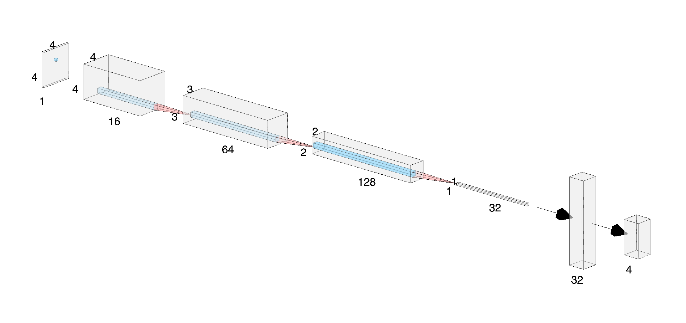

# DQN-2048
Use DQN to learn how to play 2048 game

## 实现

使用Double DQN实现，具体细节如下：

1. 网络结构为三层conv2d+一层fc；

2. 输入为局部one-hot（用one-hot来表示格子中的数值），输入矩阵维度为16\*4\*4;

3. 输出为四个动作（上下左右）的目标Q值；

4. reward为增加的分数取log2，即这一步合成出的数字+新出现的数字；

5. 当进行非法移动时，reward为-10；

6. $\gamma$随训练轮次逐步增加；

7. 探索（随机选择行动）概率随训练轮次逐步减小；

8. 记忆池深度5000；使用一个单独的记忆池存放后期数据，提高后期数据的训练量；

   

这里有几个细节需要说明一下：

首先是取log2和one-hot编码的处理，这是因为2048中出现的数字比较离散，都是2的幂次，直接使用的话输入/标签中数值差距太大，不利于网络的训练，对于输入的处理，经过尝试one-hot相比log2效果更好一些；

记忆池深度不能过大，2048游戏有其特殊性，即对极为长远利益的规划是Q-learning不非常擅长的，而若规划不当则很难收集到足够的后期局面数据而充斥大量的前期局面，因此这里使用大记忆池效果不佳，这是与其他DQN应用中有明显不同的，而另一个单独数据池也是出于希望更多的训练后期局面的考虑。

探索概率也是同样的问题，需要在一定的探索期后快速收敛来使得局面能够走向后期，若持续保持相对高的探索率，则游戏很难玩出高分局面。

非法移动是一个我们不希望看到的情况，因为非法移动后状态不变，因此网络选择的行动也不会变，也就是会卡死。在环境中，我们设置最大的非法移动次数为10次，超过次数则会结束游戏，每次非法移动都会获得-10的奖励来惩罚网络输出非法移动。另外添加如下的策略：当agent做出非法移动，则下一次强制随机行动。

## 总结

当前能达到2048的次数还不是很多，并且我发现仍然存在一些会在前期就执行非法操作导致游戏结束的情况，从表现上看还有一些可以做的工作可能能够进一步提高性能，由于训练的太慢就不做尝试了，有兴趣的同学可以试试：

1. 优化采样，使得网络能够充分训练后期局面；
2. 使用Dueling DQN架构；
3. 优化$\gamma$,$\epsilon$参数和参数退火方式；
4. 优化神经网络结构；
5. emb代替one-hot；
6. ...

